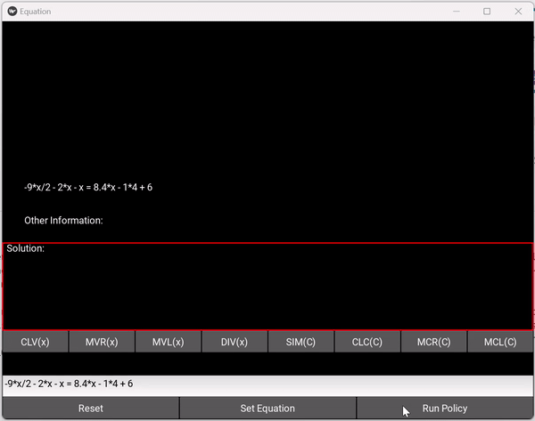

# Setup Instructions
1. Clone the repository
2. Create a `conda` environment.
3. Activate the `conda` environment and then install the required packages using `pip install -r requirements.txt`
4. Make sure to activate the `conda` environment before running any scripts/code.

# Inferencing Instructions
The best model is saved in the `src/.models` directory. To run the model on your custom equations, run the following command:
```bash
python src/symrl/run_gui.py
```
This will open a GUI (as shown below) where you can input your custom equations and get the results.

<!-- Add the gif image here -->


One can also run the best trained model on the test data by running the following command:
```bash
python src/symrl/run_inference_on_test_data.py
```
Lookup the folder `src/.logs/_test__term_var_const_gtr_cnt_lin__td__gr` for the results of the test run. The results will be dumped in a folder with timestamp as the folder name. Lookup for the file `replay.log` it will detailed contain the results of the test run for each of the test equations. `policy.log` will contain a human readable summary of the test run. `summary.log` will contain the summary of the test run with some aggregated statistics.

# Training Instructions
To train the model with the best configuration, run the following command:
```bash
python src/symrl/run_train_with_best_config.py
```
Lookup the folder `src/.logs/term_var_const_gtr_cnt_train__simpl_term_var_const_count_lin__td__eps` for the results of the test run. The model along with the logs will be saved in the folder with timestamp as the folder name. Individual checkpoints will be saved in the `src/.logs/term_var_const_gtr_cnt_train__simpl_term_var_const_count_lin__td__eps/<timestamp>/model/ckpt` folder. The training logs will be dumped in the `src/.logs/term_var_const_gtr_cnt_train__simpl_term_var_const_count_lin__td__eps/<timestamp>/` folder with the name `policy.log`, `replay.log` and `summary.log`.

# Exuastive Training and Abalation Study
To run the exhaustive training and ablation study, run the following command:
```bash
./src/symrl/experiments.sh
```
>Note: This can take 1-2 days to complete depending on the hardware configuration.

# Generating the Report
To generate the report (i.e. plots and table summary) after running the exhaustive training and ablation study, run the following command:
```bash
python src/symrl/analysis.py --analysis_json "<path-to-analysis-json>" --plot_folder "<path-to-output-dir>" --plot_name "<name-of-the-plot>"
```
You will have to create the analysis json file which might look like:
```json
[
    {
        "name": "TVCC w Comparison",
        "folder": "src/.logs/100_25_test__simpl_term_var_const_count_lin__td__gr_eval/20240418_064630"
    },
    {
        "name": "TVCC",
        "folder": "src/.logs/100_25_test__term_var_const_count_lin__td__gr_eval/20240418_061200"
    },
    {
        "name": "TVC w Comparison",
        "folder": "src/.logs/100_25_test__op_var_count_lin__td__gr_eval/20240418_061200"
    },
    {
        "name": "TC",
        "folder": "src/.logs/100_25_test__op_count_lin__td__gr_eval/20240418_061200"
    },
    {
        "name": "Hand-Crafted Strategy",
        "folder": "src/.logs/human_test/20240421_153646"
    },
    {
        "name": "Random Strategy",
        "folder": "src/.logs/random_test/20240422_001813"
    }
]
```

>Note: Do remember to replace the paths with the actual paths of the folders (usually you just have to replace the timestamp in the path).